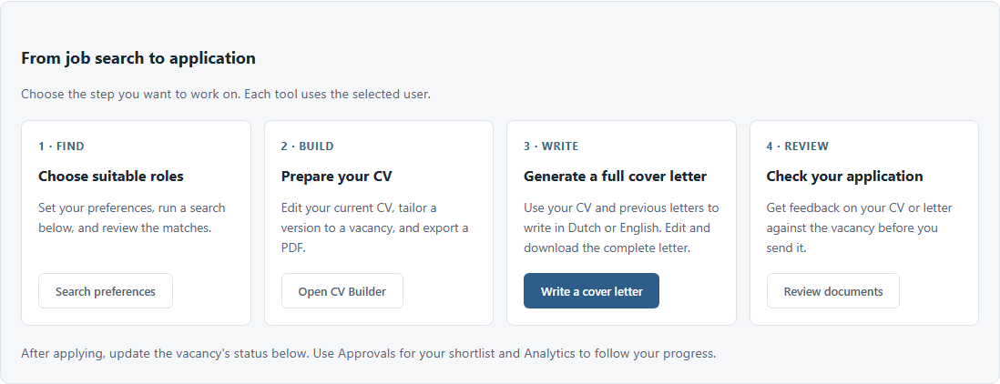
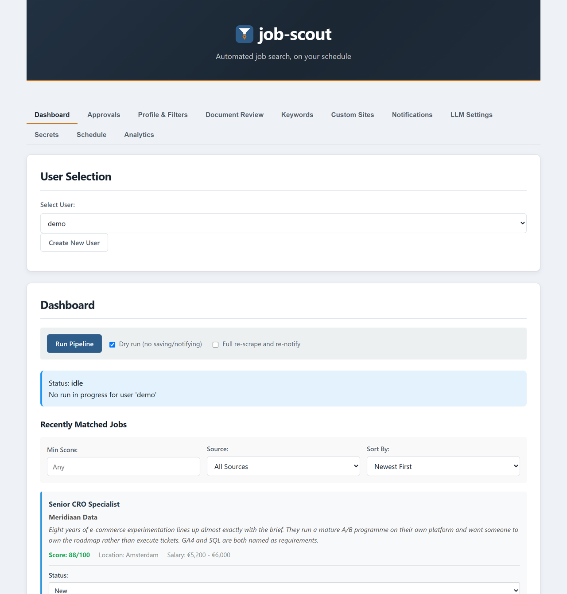

<div align="center">

<picture>
  <source media="(prefers-color-scheme: dark)" srcset="assets/logo-dark.png">
  
</picture>

<p><strong>Your job search, run overnight by a machine that has actually read your CV.</strong></p>

<p>job-scout sweeps the Dutch job boards every week, scores every vacancy against your real profile with an LLM you choose — including one running on your own hardware — and only tells you about the handful you could realistically get to and would actually want.</p>

[](https://github.com/JvWageningen/job-scout/actions/workflows/ci.yml)
[](https://github.com/JvWageningen/job-scout/releases)
[](https://www.python.org/downloads/)
[](LICENSE)
[](https://docs.astral.sh/ruff/)
[](https://mypy-lang.org/)
[](https://github.com/sponsors/JvWageningen)

</div>

---

Job boards are optimised for volume, not for you. A saved search returns hundreds of listings that match a keyword and nothing else: wrong seniority, wrong discipline, ninety minutes away, pay you would never accept. Reading them is the actual work of a job hunt, and it is the part nobody wants to do.

job-scout does that reading. It scrapes Indeed, LinkedIn, Nationale Vacaturebank and any company careers page you point it at, then puts every listing through a funnel of progressively more expensive checks — a cheap title filter, a batched LLM screen, a real commute calculation, a quick score, and finally a full evaluation against your CV and your stated preferences. What reaches your phone is a short list with a fit score, a reason, the commute by car, bike and train, and a link to the employer's own posting where one exists.

It runs on your machine or your NAS. With a local model, no part of your CV ever leaves your network.

## Features

| Capability | What it does |
|---|---|
| **Scored against your actual CV** | Your CV PDF is parsed into a structured profile and every vacancy is evaluated against it — fit score, reasoning, and an explicit check against the things you said you do *not* want. |
| **Real commute filtering** | Every listing is geocoded and routed by car, bike and NS public transport before any expensive model sees it. Set a ceiling per mode; anything beyond it never reaches you. |
| **Bring your own LLM** | Local OpenAI-compatible servers (Ollama, LM Studio, vLLM, llama.cpp), Z.AI GLM, the Claude Code CLI or the Kilo Code CLI — and you can route each stage to a different one, a cheap model for screening and a strong one for the final call. |
| **Career tracks** | Search several genuinely different directions at once, each with its own description, keywords and reject rules, plus blend tracks for a flavour you want *inside* a role rather than as a job of its own. |
| **Guided career coach** | Not sure what you are looking for? A short interview, grounded in what your CV already shows, proposes a handful of concrete directions — accept the ones you like and they are written back as tracks. |
| **Pay and holiday gate** | The model extracts salary and vacation days from the posting and a conservative Dutch-aware regex re-scans the full text as a backstop. Below your floor, above your ceiling: gone. |
| **Never a dead link** | Every match is re-checked live before you are notified, and jobs already in your pipeline are swept for filled-or-closed signals. |
| **Match enrichment** | Each match gets a web search for the vacancy on the employer's own site or ATS, plus a cached, evidence-backed review of what it is like to work there. |
| **Application toolkit** | Tailor your resume to a posting's keywords and render it to PDF, draft a cover letter, and pre-answer the application's screening questions in your own voice. |
| **Designed CV builder** | Write your CV section by section in the browser — seven section kinds across a sidebar and a main column — and watch it render live to a two-column PDF with a coloured sidebar, a circular portrait and embedded fonts. Import the CV you already have to start from, or begin empty with placeholder text showing the layout. The plain ATS-safe resume stays available for upload boxes that would mangle it. |
| **CV tailored to one vacancy** | Retarget that designed CV at a single posting: relevant roles and skills move to the front, prose is reworded, and the result is saved as a profile of its own. Employers, titles, schools and dates are frozen — a CV that came back having gained an employer is rejected, not handed to you. |
| **Full cover letters in your voice** | Choose Dutch or English, draw on your own CV, CV Builder, a LinkedIn import and your profile together, and learn your tone from private examples. Review and edit the draft, save a version per vacancy and language, and download a matching PDF or plain text. [Cover Letter Writer guide](docs/LETTER_WRITER.md). |
| **Document review** | An honest second opinion before you send anything: your CV in general or as an application for one specific vacancy, or a motivational letter judged against the posting it answers. Nothing is saved or sent. |
| **Interview prep** | Keep a reusable bank of STAR stories, then have the behavioural questions a posting is likely to ask extracted and matched to the story that best answers each one. |
| **Questions you ask them** | The other half of the interview: when they ask whether you have any questions, arrive with ones built from this vacancy, what web search found about the company, and your own CV — including the uncomfortable ones a reported weakness deserves. Grouped by theme, each with why it matters for you and what it was based on. [Interview questions guide](docs/INTERVIEW_QUESTIONS.md). |
| **Questions they ask you, answered** | The mirror image: the questions this interviewer is likely to put to you, each with a draft answer you can edit into your own words. An answer may use nothing beyond your CV, your STAR stories and your notes — never an invented employer, tool or number — and where the evidence is not there it says so and the question is marked as a gap, so that is the one you rehearse. [Same guide](docs/INTERVIEW_QUESTIONS.md). |
| **Search and shortlist** | Search every saved vacancy by title, employer, location, description or URL. Pin promising roles, filter by match score, and track six clear application stages. Company research stays available beneath the vacancy’s own match score. |
| **Self-hosted control room** | A web dashboard with live per-stage progress and a stop button, four push channels (ntfy, email, Slack, Discord), per-user databases and configs, a container-native weekly scheduler that wakes a sleeping GPU host over Wake-on-LAN, and an MCP server for querying your pipeline from an AI client. |



## Quick start

**Windows** — requires [Docker Desktop](https://www.docker.com/products/docker-desktop/); the installer offers to fetch it if missing.

```powershell
powershell -ExecutionPolicy Bypass -Command "iwr -useb https://raw.githubusercontent.com/JvWageningen/job-scout/main/deploy/install.ps1 | iex"
```

**Linux** — requires [Docker Engine](https://docs.docker.com/engine/install/); the installer offers to fetch it if missing.

```bash
curl -fsSL https://raw.githubusercontent.com/JvWageningen/job-scout/main/deploy/install.sh | bash
```

Both installers are idempotent: run the same command again to update. For an always-on NAS or server, see [docs/DEPLOY.md](docs/DEPLOY.md).

### After installing

1. **Open the dashboard** at `http://localhost:24817` and create your user.
2. **Point it at an LLM** under LLM Settings — nothing that follows works without one. A local OpenAI-compatible server (Ollama, LM Studio) is the default and needs no key, just a model actually running; for a hosted model, paste a Z.AI key under Secrets. The backends and per-stage routing are in [docs/LLM_PROVIDERS.md](docs/LLM_PROVIDERS.md).
3. **Fill in Profile & Filters** — your CV path, home address, commute ceilings per mode, salary floor, and a short description of what you are looking for (and what you are not).
4. **Generate keywords** from the Keywords tab, which derives your search terms and title include/exclude lists from that profile and your CV.
5. **Run once**, review the matches, then set your weekly slots and notification channel under Schedule and Notifications.

Full walkthrough: [docs/USAGE.md](docs/USAGE.md) · dashboard tour: [docs/WEB_DASHBOARD.md](docs/WEB_DASHBOARD.md).

### Developer install

Requires Python 3.12+ and [uv](https://docs.astral.sh/uv/).

```bash
git clone https://github.com/JvWageningen/job-scout.git
cd job-scout
uv sync

uv run job-scout init --user alex              # interactive setup
uv run job-scout keywords refresh --user alex  # derive keywords from profile + CV
uv run job-scout run --user alex --dry-run     # full pipeline, no saving, no notifications
```

Every command is documented in [docs/USAGE.md](docs/USAGE.md); every setting in [docs/CONFIGURATION.md](docs/CONFIGURATION.md).

## How it works

One `job-scout run` is a funnel. Each stage is cheaper than the one it feeds, and I/O and LLM calls are parallelised within a stage, so the expensive full evaluation only ever sees listings that already survived a title filter, an LLM screen and a real routing calculation.

```text
  invalidate stale evaluations     profile changed? drop the cached scores
  auto-prune active jobs           optional: expire vacancies already filled
            │
  scrape ───┴──► Indeed · LinkedIn · Nationale Vacaturebank · custom career pages
            │    (parallel across sources, deduplicated within the batch)
            ▼
  deduplicate against the database
            ▼
  title filter                     rule-based, morpheme-aware include/exclude
            ▼
  LLM title screen                 batched — many titles per call
            ▼
  commute filter                   geocode + car / bike / NS routing vs your limits
            ▼
  quick evaluation                 cheap per-track score, best track recorded
            ▼
  full evaluation                  fit score · negative match · salary · vacation
            ▼
  compensation filter              LLM extraction + deterministic regex backstop
            ▼
  verify still open                expire anything filled since it was scraped
            ▼
  enrich                           employer's own posting URL · company review
            ▼
  notify                           ntfy · email · Slack · Discord, per job or digest
            ▼
  save run statistics              stage timings and counts for the Analytics tab
```

Evaluations are cached by normalised title and company, so a vacancy cross-posted to three boards never costs three LLM calls — and the cache is invalidated automatically when you change your profile.

job-scout is built for one person running a personal job hunt at modest volume; whether scraping a given board is permitted is governed by that site's terms of service and the law where you live, not by this project — see [SECURITY.md](SECURITY.md).

## Dashboard


Everything the pipeline produces is browsable and editable from a self-hosted web UI: a searchable vacancy library with pins and application progress, profile and filters, keywords, custom sites, LLM routing, secrets, schedule and analytics — with live per-stage progress while a run is in flight.

<p align="center">
  <a href="assets/dashboard.png">
    
  </a>
</p>

<sub align="center">Demonstration data. Every company and vacancy shown is fictional.</sub>

## Documentation

| Document | Contents |
|---|---|
| [docs/README.md](docs/README.md) | Documentation index — start here |
| [docs/USAGE.md](docs/USAGE.md) | Full CLI reference and day-to-day workflows |
| [docs/CONFIGURATION.md](docs/CONFIGURATION.md) | Every global key, per-user key, secret and environment variable |
| [docs/LLM_PROVIDERS.md](docs/LLM_PROVIDERS.md) | The four backends and per-stage routing |
| [docs/NOTIFICATIONS.md](docs/NOTIFICATIONS.md) | ntfy, email, Slack and Discord; modes and retry |
| [docs/CV_BUILDER.md](docs/CV_BUILDER.md) | The CV editor, the designed PDF, vacancy tailoring and the ATS trade-off |
| [docs/WRITING_STYLE.md](docs/WRITING_STYLE.md) | The house style every generated letter, answer and review follows, and why |
| [docs/WEB_DASHBOARD.md](docs/WEB_DASHBOARD.md) | Dashboard tabs, token auth and security posture |
| [docs/DEPLOY.md](docs/DEPLOY.md) | Docker, NAS and server deployment |
| [ARCHITECTURE.md](ARCHITECTURE.md) | How the pieces fit together, and why |
| [CHANGELOG.md](CHANGELOG.md) | Release history |
| [LICENSE](LICENSE) | GNU AGPL v3.0, in full |

## Contributing

Contributions are welcome — bug reports, new scrapers, better prompts, documentation fixes. Commits follow [Conventional Commits](https://www.conventionalcommits.org/), because the release version and changelog are generated from them, and CI must pass ruff, ruff format, pytest and mypy before anything merges.

Read [CONTRIBUTING.md](CONTRIBUTING.md) for the dev setup and the pull request process, and [CODE_OF_CONDUCT.md](CODE_OF_CONDUCT.md) for the ground rules. Security issues go to [SECURITY.md](SECURITY.md) rather than the public tracker.

## Support this project

job-scout is free for your own job hunt, for study and research, and for charities, schools and public bodies — every release under these terms stays free for those uses. Sponsorship pays for the time that goes into new scrapers, better evaluation prompts and keeping the Dutch job boards working as they change.

<div align="center">
<a href="https://github.com/sponsors/JvWageningen"></a>
</div>

## License

[GNU Affero General Public License v3.0 or later](https://www.gnu.org/licenses/agpl-3.0.html) — see [LICENSE](LICENSE). SPDX identifier: `AGPL-3.0-or-later`.

job-scout is free software, in the OSI and FSF sense: use it, study it, change it and share it, commercially or not. The one obligation that matters is reciprocity — if you distribute a modified version, **or run one as a network service that other people use**, those people must be able to get its complete source under the same licence. That last clause is what separates the AGPL from the GPL, and it is the reason for it here: job-scout ships a web dashboard, so a hosted fork is exactly the case worth covering.

In practice, for the people this was built for, nothing changes. Running it for your own job hunt, editing it, and sharing your changes with friends carries no obligation to anyone. The licence only bites when you hand a modified version to someone else.

The entire **v1.x** line, up to and including v1.17.3, was released under the MIT licence. That grant is irrevocable: anyone who obtained those versions keeps their MIT rights to that code permanently. The AGPL terms apply from **v2.0.0** onward.

If the AGPL genuinely does not work for your situation, open a [GitHub Discussion](https://github.com/JvWageningen/job-scout/discussions) — a separate arrangement is possible in principle.
